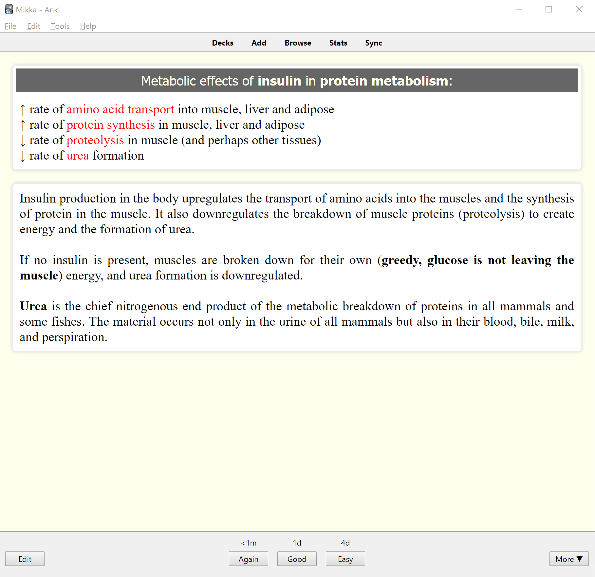

# Anki Templates

*Please(!)* be careful here. Many of those templates (marked as "front and back") do have their own HTML structure along with styling. If you want to set up Anki this way, that's the way to do it, but don't go installing this one over your own unless you're OK with having things look my way.

# Bright, Front, Back, Extra, Sources, Headline

A bright look with all the fixins. A headline field (not shown in cards if it's not filled out), a "sources" field to add your own sources to each card (used in my card decks), bright colors, nice contrasts, and a (hopefully) good reading and learning experience.